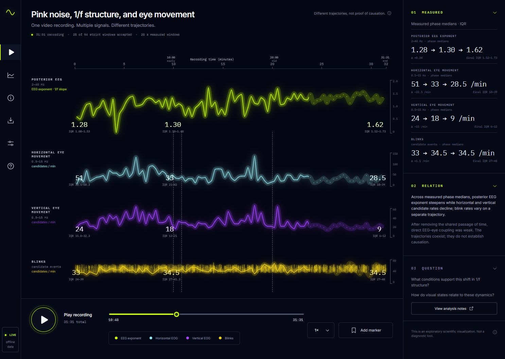
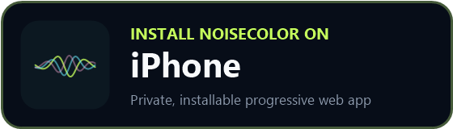
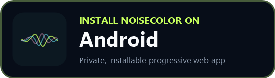

# Pink Noise Relational Field

An interactive scientific visualization of posterior EEG 1/f structure, eye-movement candidates, and blink candidates from a 31:31 video recording. The interface keeps measured results, interpretation, and open questions visibly separate.



## Download / Install NoiseColor

NoiseColor is a mobile-first Progressive Web App for live microphone spectral-color analysis. The installable PWA is the iPhone and Android app experience; it is not currently distributed through the Apple App Store or Google Play.

<a href="https://swalkernuro.github.io/pink-noise-relational-field/noisecolor/?install=ios"></a>
<a href="https://swalkernuro.github.io/pink-noise-relational-field/noisecolor/?install=android"></a>

**[Open NoiseColor Web App](https://swalkernuro.github.io/pink-noise-relational-field/noisecolor/)**

On iPhone or iPad, open the iPhone link in Safari, use **Share → Add to Home Screen**, enable/open as a web app where offered, and tap **Add**. On Android, the install control opens the native PWA prompt when Chromium exposes it; otherwise NoiseColor shows concise browser-specific instructions.

**Audio is analyzed locally and is not uploaded to a server.** Live Analysis keeps only a bounded rolling buffer in memory and does not persist raw microphone audio. Recording and raw-audio download are explicit, opt-in actions.

## What is included

- A full-screen temporal field with four stacked measured trajectories: posterior EEG exponent, horizontal EOG candidates, vertical EOG candidates, and blink rate.
- Early, middle, and end annotations calculated at runtime as medians and interquartile ranges from the Video rows in [`movement_windows.csv`](public/data/movement_windows.csv).
- A condition comparison panel populated from [`condition_eye_movement_summary.csv`](public/data/condition_eye_movement_summary.csv), with every condition compared against the Video reference.
- Functional playback, timeline scrubbing, playback speed, markers, section toggles, CSV download, glow control, and value-label control.
- A standalone [NoiseColor](public/noisecolor/index.html) spectral analyzer at `/noisecolor/` that can record microphone input or decode a local audio file with picker and drag-and-drop input.
- GitHub Pages and OpenAI Sites-compatible production output.

## Data integrity

The temporal chart does not use a staged or hand-authored trend. Each line passes through the corresponding measured value from a 20-second Video window. The visual stacking applies only a fixed affine display mapping so signals with different units can share the field; it does not change the source values shown in tooltips or summaries.

Phase summaries use these recording-time partitions:

| Phase | Video midpoint range | Windows |
| --- | --- | ---: |
| Early | 0:00–9:59 | 30 |
| Middle | 10:00–19:59 | 30 |
| End | 20:00–31:31 | 34 |

The condition panel uses condition-level EEG fits and median EOG/blink rates directly from `condition_eye_movement_summary.csv`.

## Scientific scope and cautions

This is an exploratory pilot visualization, not a diagnostic tool. The dataset represents one participant with fixed condition order. EOG polarity was not calibrated, gaze-video ground truth was unavailable, and the vertical EOG channel also contains blinks. Candidate events come from an adaptive detector rather than manually validated eye tracking.

A changing EEG exponent and changing eye-movement rates can coexist without establishing a causal mechanism. The interface therefore labels the data as measured, keeps relational language interpretive, and presents unanswered questions separately.

## NoiseColor audio input and scientific scope

NoiseColor estimates the spectral exponent β in `P(f) ∝ 1/f^β` with Welch power spectral density and a log-log power-law fit. It supports:

- continuous live microphone analysis over HTTPS or localhost, using fast and stable rolling estimators;
- explicit, opt-in microphone recording with browser-detected recording formats, a two-minute capture cap, and bounded chunk memory;
- local WAV, MP3, M4A, AAC, OGG, and FLAC files supported by the browser;
- mono mixing for multichannel files;
- files up to 40 MB;
- a bounded final 120-second analysis window for longer recordings/files, with the full source duration and analyzed offset retained in exports;
- temporal β analysis with mean, standard deviation, history, and a color timeline;
- continuous PSD, contextual third-octave bands, a live spectrogram, fit diagnostics, spectral flatness, signal level, and clipping checks;
- optional, named, input-route-specific microphone frequency-response correction profiles;
- local-only IndexedDB history for compact metadata and analysis summaries, never raw audio by default, limited to the 100 most recent saved results and 25 records per read;
- reproducible JSON and CSV exports containing estimator, fit, quality, source, complete calibration correction points and hash, privacy-safe route labels, and version metadata.

Uncompressed PCM WAV files are parsed directly so only the final bounded analysis window is converted to mono PCM. Browser-supported compressed formats must still be decoded by the browser before NoiseColor can select the final window; the 40 MB file cap reduces but cannot eliminate that unavoidable peak-memory limitation on phones.

The canonical β estimate always uses the **unweighted continuous PSD**. Third-octave and future acoustic weighting views are secondary context only and never drive noise-color classification. Scalar gain/SPL calibration does not materially change β; optional frequency-response correction can change β and is therefore reported transparently.

NoiseColor does not force every sound into a canonical color. Silence, clipping or limiting, strongly tonal input, unstable β, insufficient duration, and poor or two-regime single-power-law fits produce explicit quality states rather than a confident color label. Tonality uses flatness plus narrowband peak prominence and tonal-power diagnostics; model adequacy compares log-frequency-binned low/high-band slopes so dense high-frequency bins cannot hide strong curvature. Classification confidence is a model-quality heuristic, not a statistical probability.

Microphones and browser audio processing are not calibrated acoustic measurement chains. Use NoiseColor for exploratory or relative spectral analysis, not sound-pressure-level measurement.

The analysis engine is independently implemented from standard FFT, Hann-window, Welch PSD, regression, spectral-flatness, and fractional-octave definitions. NoiseCapture informed product concepts only; no GPLv3 NoiseCapture source is copied, translated, ported, or adapted.

## Local development

Requirements: Node.js 20 or newer and npm.

```bash
npm ci
npm run dev
```

Vite serves the relational field at `/` and NoiseColor at `/noisecolor/index.html`; static production hosts also resolve `/noisecolor/`.

## Tests and production build

Run the complete verification suite:

```bash
npm run verify
```

The suite validates CSV parsing and measured phase summaries, condition-summary wiring, NoiseColor file upload, synthetic colored-noise recovery, quality gates, low-sample-rate behavior, state-machine hysteresis, PWA scope, repository hygiene, the production client build, the server worker fallback, and Sites packaging.

Local browser verification covers the `/noisecolor/` route, portrait layout, uploaded-audio analysis, scientific views, install instructions, manifest/icons, service-worker scope, offline launch, and the unchanged parent application. A final physical-device pass is still required for iPhone Safari and Android Chromium microphone permissions, installation prompts, safe-area behavior, calls/screen lock, Bluetooth route changes, and long-run thermal performance; those behaviors were not claimed as exercised in the desktop browser environment.

Individual commands:

```bash
npm test
npm run build
npm run test:sites
```

`npm run build` writes the Vite client to `dist/client` and prepares:

- `dist/client/index.html`
- `dist/server/index.js`
- `dist/.openai/hosting.json`

## Deployment

The workflow in [`.github/workflows/deploy-pages.yml`](.github/workflows/deploy-pages.yml) builds and deploys `dist/client` to GitHub Pages after pushes to `main`. Vite derives the repository base path from `GITHUB_REPOSITORY` in GitHub Actions, so assets and data files resolve under the Pages project path.

The worker and hosting manifest also allow the same verified build to be handed to OpenAI Sites without changing the application runtime.

## Repository map

```text
src/                    React interface and measured-data utilities
public/data/            Validated pilot analysis tables and summary metadata
public/noisecolor/      Standalone NoiseColor PWA, analysis engine, workers, and mobile UI
docs/design/            Selected visual target and design-QA screenshots
docs/assets/            Custom NoiseColor install badges
tests/                  Data, repository, and Sites worker tests
worker/                 Static asset worker with app-shell fallback
scripts/                Sites build preparation
```

The selected design reference and comparison evidence are documented in [`docs/design`](docs/design) and [`design-qa.md`](design-qa.md).

## License

Released under the [MIT License](LICENSE).
